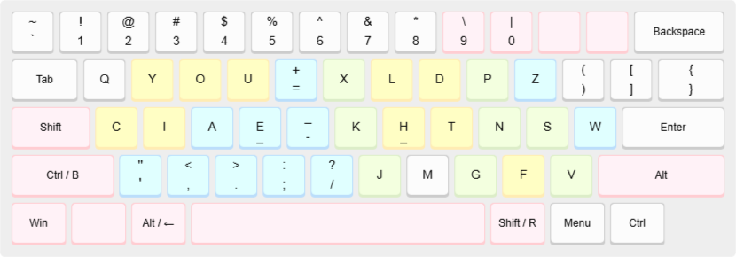
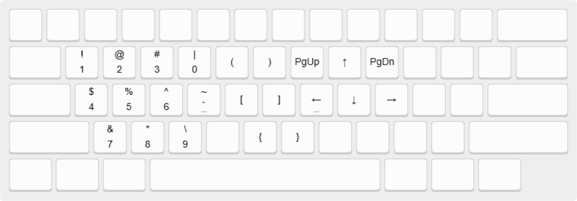

# Enthium — slightly modified

>*Legend:* QWERTY=white, Engram=yellow, Promethium=green, Enthium=blue, Custom=pink.
>

See [original enthium](https://github.com/sunaku/enthium) for details.

## Changes
- work in progress
- provding [keyd](https://github.com/rvaiya/keyd) and [kanata](https://github.com/jtroo/kanata) implementations
- moved ctrl and shift keys around
- moved brackets
- added overload/mod tap keys (leftshift -> leftctrl/b, lalt -> lalt/backspace, ralt -> rightshift/r)
	- tap for "letter", hold for modifier
- added symbol layer
	- 
- added (some) ctrl qwerty shortcuts overrides
	- so common shortcuts like ctrl-v dont require right hand
- added mirrored layer cuz why not
	- goal is to allow 1 hand typing, doesn't quite work yet

## Installation

### General setup

- Download kanata.kbd and install Kanata following instructions [here](https://github.com/jtroo/kanata)

### Linux setup

- Alternativly, on Linux, you can choose to use keyd instead of kanata
- Download and extract keyd.zip to config location (probably /etc/keyd) then install keyd following insturctions [here](https://github.com/rvaiya/keyd)